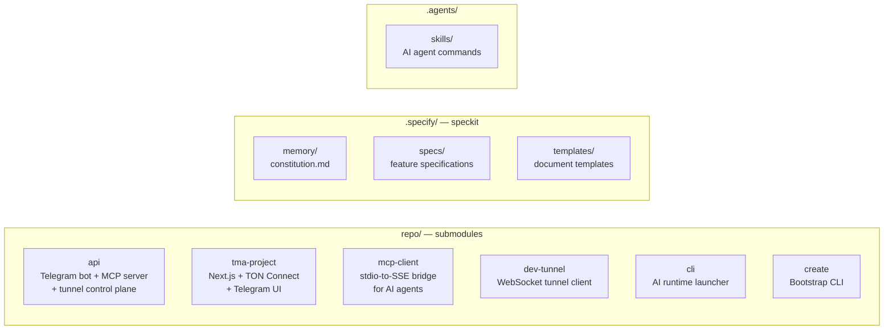
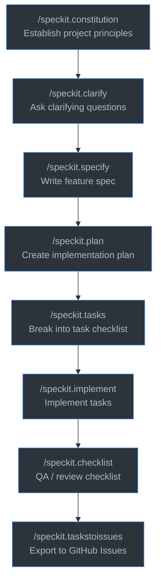

# SpawnDock Workspace

**Development workspace for the SpawnDock platform.**
Combines all components as git submodules with a spec-driven development workflow powered by **speckit**.

---

## Repository layout



---

## Getting started

### 1. Clone with submodules

```bash
git clone --recurse-submodules git@github.com:SpawnDock/agent.git SpawnDock
cd SpawnDock
```

If already cloned without `--recurse-submodules`:

```bash
git submodule update --init --recursive
```

### 2. Install dependencies

```bash
pnpm install --recursive
```

Each directory under `repo/` is an independent package — navigate into it and follow its own README.

---

## Spec-driven development

This workspace uses **speckit** — an AI-assisted workflow for going from idea to implementation through structured documents. All commands are slash-commands in Cursor (via `.agents/skills/`).

### Workflow



You can enter the workflow at any stage. Each command reads artifacts produced by earlier stages.

### Commands

| Command | Description |
| :--- | :--- |
| `/speckit.constitution` | Create or amend project principles |
| `/speckit.clarify` | Generate clarifying questions before writing a spec |
| `/speckit.specify` | Create a feature spec from a plain-language description |
| `/speckit.plan` | Produce a technical design plan |
| `/speckit.tasks` | Break a plan into an ordered task list |
| `/speckit.implement` | Work through tasks in the task list |
| `/speckit.checklist` | Generate a QA checklist |
| `/speckit.analyze` | Analyze code for quality, coverage, or design issues |
| `/speckit.taskstoissues` | Convert a task list into GitHub Issues |

### Example

```
/speckit.specify Add a settings screen where users can change their display name
```

Creates `.specify/specs/<number>-<slug>/spec.md` on a new branch with prioritized user stories and acceptance criteria.

---

## Project constitution

Non-negotiable principles in `.specify/memory/constitution.md`:

| Area | Standards |
| :--- | :--- |
| **Code quality** | Zero linter warnings, single responsibility, no dead code |
| **Testing** | TDD, 80 % coverage floor, deterministic tests, CI gate |
| **UX** | Design tokens, WCAG 2.1 AA, error states, API contract stability |
| **Performance** | Bundle ≤ 150 KB gzip, API p95 ≤ 500 ms, no N+1 queries |

All pull requests must pass these quality gates before merging.

---

## Feature specifications

Specs live under `.specify/specs/`. Each folder maps to a git branch:

| File | Contents |
| :--- | :--- |
| `spec.md` | User stories, functional requirements, success criteria |
| `plan.md` | Technical design and implementation plan |
| `tasks.md` | Ordered task checklist |

Current specs:

- [`spawndock-tma-platform`](.specify/specs/spawndock-tma-platform.md) — End-to-end AI-powered TMA creation platform
