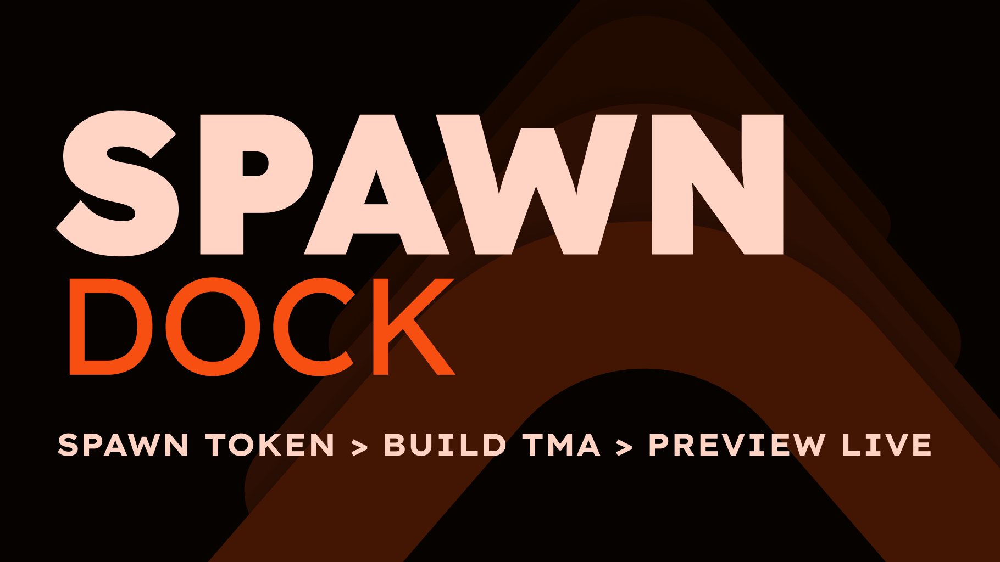

# SpawnDock - AI Agent Infrastructure for Building

https://identityhub.app/contests/ai-hackathon?submission=cmn6mzbcf01a901nvcowgfokd

SpawnDock is an open-source agent infrastructure platform that takes a developer from idea to a working Telegram Mini App with AI tooling in under 2 minutes. Send `/new` to the bot, run one command - get a project with TON Connect, Telegram UI, live preview tunnel, and a connected AI knowledge server. Five npm packages, all MIT-licensed, each usable independently.

Product quality:
Complete end-to-end product cycle - from project creation via Telegram bot (@TMASpawnerBot) to live preview inside Telegram Mini App. 5 packages published on npm with canary and release channels. Landing page, bot branding, OpenAPI documentation, Swagger UI - everything is production-ready and usable today.

Technical execution:
Custom WebSocket tunnel protocol (v1) with heartbeat, automatic reconnect, and device authentication. Pairing flow uses one-time tokens with device-to-project binding. AI knowledge server with BM25-ranked search across 55+ documents, powered by Qwen (open-weight model) - no proprietary API dependency. Effect-TS architecture in CLI packages. Caddy reverse proxy with TLS termination. Docker Compose for prod and dev environments. CI/CD via GitHub Actions with automated deployment.

Ecosystem value:
AI agents gain structured TON knowledge through the MCP protocol: smart contracts (17 docs), TMA development (12), TON Connect (3), deploy guides (3), ready-to-use templates (6), SDK references (10). Every package is MIT-licensed and reusable independently of the platform. Dev tunnel enables TMA preview inside Telegram without deploying to a server. Future roadmap includes integrating Cocoonas a decentralized AI inference provider and using TON Sites / TON Storage for hosting projects built with SpawnDock — moving the full stack onto TON infrastructure.

User potential:
From idea to working TMA with AI tooling in 2 minutes. A developer sends `/new` to the bot, runs `npx @spawn-dock/create` - and gets a Next.js project with TON Connect, Telegram UI, live tunnel, and a connected AI knowledge server accessible from Claude Code, Cursor, Amp, or Codex. The platform scales: each package works independently, tunnel supports multiple concurrent projects, knowledge base is extensible.

Architecture:
Five published packages: `@spawn-dock/create` (bootstrap CLI), `@spawn-dock/dev-tunnel` (WebSocket tunnel client), `@spawn-dock/mcp` (MCP knowledge bridge), `tma-project` (Next.js + TON Connect starter), `api` (Telegram bot + MCP server + knowledge search + tunnel control plane).

**Select track:** Agent Infrastructure
**GitHub repository URL:** https://github.com/SpawnDock/agent
**Demo URL:** https://spawn-dock.w3voice.net/
**Additional links**
- bot: https://t.me/TMASpawnerBot
- contact: https://t.me/w3voice
- HQ: https://github.com/SpawnDock
